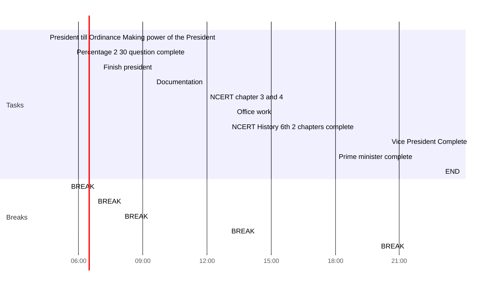

## Day Planner

- [ ] ## Day Planner

This is my plan for the day broken:

**Full  Prep**

This is where I get ready for work and do my usual prep.

- [x] 04:30 President  till Ordinance Making power of the President
- [x] 05:30 BREAK
- [x] 05:45 Percentage 2 30 question complete
- [x] 06:45 BREAK
- [x] 07:00 Finish president
- [x] 08:00 BREAK
- [x] 09:30 Documentation
- [x] 12:00 NCERT chapter 3 and 4
- [x] 13:00 BREAK
- [x] 13:15 Office work
- [x] 19:00 NCERT History 6th 2 chapters complete
- [x] 20:00 BREAK
- [x] 20:30 Vice President Complete
- [x] 21:45 Prime minister complete
- [ ] 23:00 END